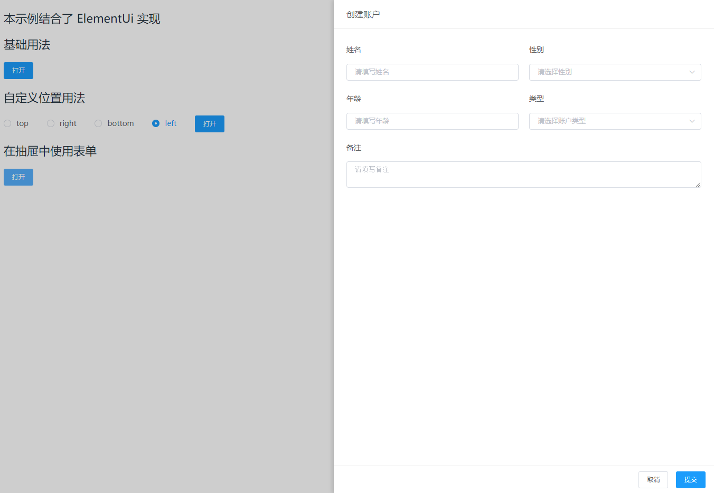

# vue-drawer-component

一个基于vue实现的抽屉组件



[点击查看在线demo](https://code-farmer-i.github.io/vue-drawer/dist/)

## Install
```shell
npm install vue-drawer-component -S
```

## Quick Start
``` javascript
import VueDrawer from 'vue-drawer-component'
import 'vue-drawer-component/src/index.css'

Vue.component(VueDrawer.name, VueDrawer)
```

### 基础用法
```html
<template>
  <div>
    <vue-drawer :visible.sync="visible">
      <div slot="header">
        Basic Drawer
      </div>
      <div slot="body">
        <p>Some contents...</p>
        <p>Some contents...</p>
        <p>Some contents...</p>
      </div>
    </vue-drawer>
  </div>
</template>

<script>
export default {
  data () {
    return {
      visible: false
    }
  }
}
</script>
```

## API

### El-Table-Editabled Props:

属性  |  说明  |  类型  |  默认值
:-------: | -------  |  :-------:  |  :-------:
data  |  footer数据  |  Array  |  --

### El-Table-Editabled Methods:

方法  |  说明  |  参数
:-------: | -------  |  :-------:
init  |  初始化footer(必须传入表格实例)  |  Function(tableInstance)

作者wx: ckang1229

